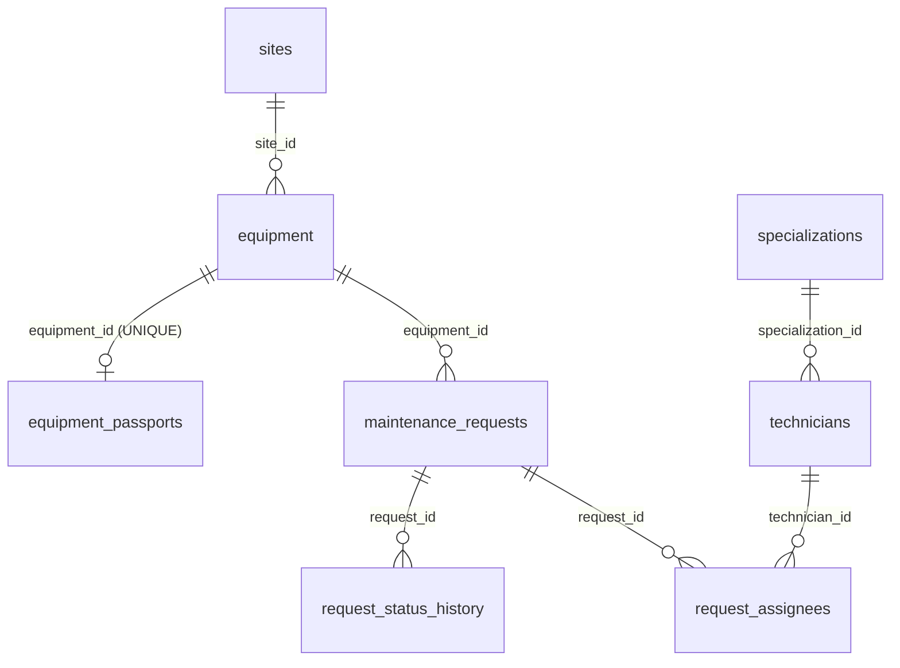

# Кейс 2 — REST API для оборудования и заявок

Express + TypeScript, данные лежат в json файле. Погода берется с Open-Meteo (модуль из первого кейса).

Нужен Node 20+.

## Запуск

```bash
cp config/.env.example config/.env.development
npm ci
npm run dev:watch
```

По умолчанию поднимается на `http://localhost:3000`, проверить можно через `/api/health`.

Прод:

```bash
cp config/.env.example config/.env.production
npm run build
npm start
```

Все переменные есть в `config/.env.example`, если чего-то не хватает приложение не стартанет.

## База данных

PostgreSQL 18, Sequelize. Схема создается только миграциями (`migrations/`), модели в `src/db/models/`.
Параметры подключения (`DB_HOST`, `DB_PORT`, `DB_NAME`, `DB_USER`, `DB_PASSWORD`, `DB_POOL_*`) берутся из `config/.env.<NODE_ENV>`.

```bash
docker compose up -d postgres   # дождаться healthy
npm run db:create               # если базы DB_NAME еще нет
npm run db:migrate
npm run db:seed
```

Откат: `npx sequelize-cli db:migrate:undo` (последняя миграция) или `npm run db:migrate:undo:all` (все). Каждая миграция идет в транзакции,
`down` удаляет и свои ENUM-типы/функции, так что цикл «применить все → откатить все → применить снова» проходит чисто.

### Схема



- `request_assignees` — связующая таблица N:M с полями `role` (`lead | member`) и `planned_hours`. PK составной
  `(request_id, technician_id)`, поэтому повторно назначить того же специалиста нельзя. Частичный уникальный индекс
  не дает назначить второго `lead`.
- `request_status_history` только дополняется: UPDATE и DELETE запрещены триггером `request_status_history_append_only`.
- `equipment` и `maintenance_requests` удаляются мягко (`deleted_at`), чтобы не терять заявки и журнал. `serial_number`
  уникален среди неудаленных записей (частичный индекс).
- Перечисления — ENUM-типы PostgreSQL, мощность, координаты и часы — `DECIMAL`, все метки времени — `timestamptz` с `now()` по умолчанию.

### Правила внешних ключей

| FK | ON DELETE | ON UPDATE | Почему |
|---|---|---|---|
| `equipment.site_id` | RESTRICT | CASCADE | площадку с оборудованием удалить нельзя |
| `equipment_passports.equipment_id` | CASCADE | CASCADE | паспорт не существует без оборудования |
| `maintenance_requests.equipment_id` | RESTRICT | CASCADE | заявки сохраняются, оборудование удаляется мягко; открытые заявки дополнительно проверяет сервис |
| `request_status_history.request_id` | RESTRICT | RESTRICT | журнал не удаляется и не изменяется |
| `request_assignees.request_id` | CASCADE | CASCADE | назначения не имеют смысла без заявки |
| `request_assignees.technician_id` | RESTRICT | CASCADE | специалиста с назначениями удалить нельзя |
| `technicians.specialization_id` | RESTRICT | CASCADE | справочник, на который ссылаются |

PK везде — неизменяемые UUID, так что `ON UPDATE CASCADE` на практике не срабатывает; для журнала стоит RESTRICT,
чтобы ссылку на заявку нельзя было переписать даже так.

## Тесты

```bash
npm test
```

Берется конфиг `config/.env.test`.

## Docker

```bash
cp config/.env.example config/.env.production   # NODE_ENV=production и API_KEY
docker compose up --build -d
```

Порт 3000, база сохраняется в volume `api-data`.

## Postman

Коллекция лежит в `docs/postman/`, импортировать в Postman и запускать. Перед этим нужно поднять сервер.
В коллекции есть переменная `baseUrl`, по умолчанию должна быть `http://localhost:3000/api`.
Если задан `API_KEY`, то на POST/PATCH/DELETE надо добавить заголовок `X-API-Key`, иначе будет 401.
