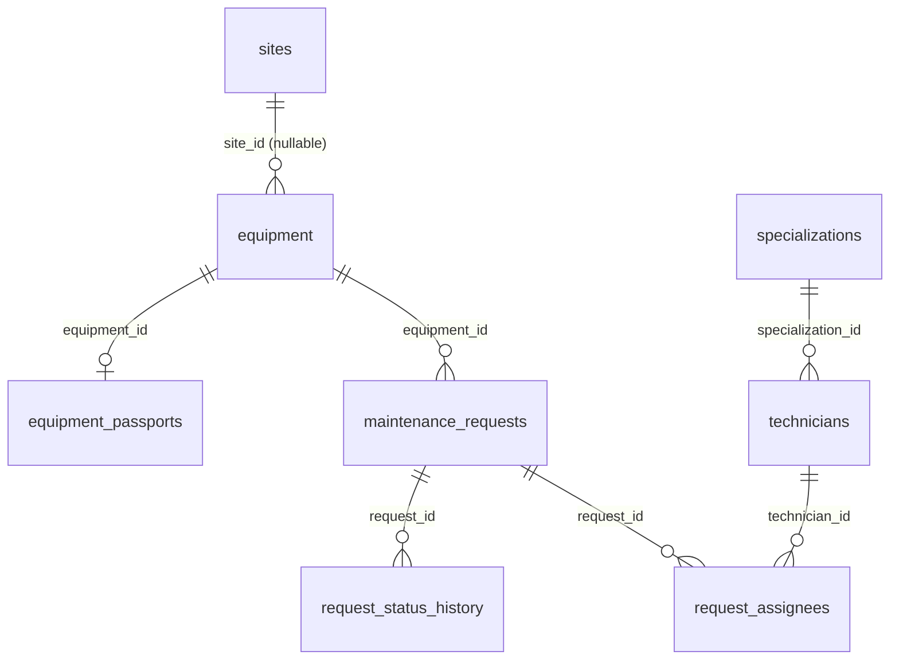

# Кейс 3 — REST API оборудования и заявок на PostgreSQL

Express + TypeScript + Sequelize + PostgreSQL 18. Кейс 2, перенесённый с JSON-файла в БД. Контракт API прежний, добавлены площадки,
паспорта, специалисты и бригады, журнал статусов и два отчёта. Погода с Open-Meteo.

## Запуск

```bash
cp config/.env.example config/.env.production      # заполнить DB_*, API_KEY
cp config/.env.production config/.env.development  # DB_* должны совпадать
npm ci
docker compose --env-file config/.env.production up -d postgres
npm run db:migrate && npm run db:seed
npm run dev:watch                                  # http://localhost:3000/api/health
```

Прод: `npm run build && npm start`. Целиком в Docker: `docker compose --env-file config/.env.production up --build -d`
(postgres → migrate → api). Сброс: `docker compose down -v`.

Переменные — в `config/.env.example`.

## Схема



- У `equipment` свои `lat/lon`, `site_id` необязателен, `serial_number` уникален среди неудалённых без учёта регистра.
- `equipment` и `maintenance_requests` удаляются мягко (`deleted_at`): на журнал и заявки стоит `RESTRICT`.
- `request_status_history` append-only (триггер на UPDATE/DELETE; `TRUNCATE` не блокируется).
- `request_assignees`: PK `(request_id, technician_id)`, не более одного `lead` на заявку (частичный индекс).

**3НФ:** специализации вынесены в справочник; паспорт — отдельная 1:1 сущность; `role` и `planned_hours` зависят от пары
(заявка, специалист), поэтому лежат в связующей таблице; координаты — атрибут единицы оборудования, у площадки свои.

| FK | ON DELETE |
|---|---|
| `equipment.site_id` | RESTRICT |
| `equipment_passports.equipment_id` | CASCADE |
| `maintenance_requests.equipment_id` | RESTRICT |
| `request_status_history.request_id` | RESTRICT |
| `request_assignees.request_id` | CASCADE |
| `request_assignees.technician_id` | RESTRICT |
| `technicians.specialization_id` | RESTRICT |

`ON UPDATE`: CASCADE везде, кроме журнала (RESTRICT).

## Новое в API

| Запрос | Что делает |
|---|---|
| `POST /api/requests/:id/assignees` | заменяет бригаду: `{assignees:[{technicianId, role, plannedHours}]}`, 1–20, ровно один `lead`, 201 |
| `DELETE /api/requests/:id/assignees/:userId` | снимает специалиста, 204 |
| `GET /api/requests/:id/history` | журнал статусов |
| `POST /api/requests/bulk` | пакетное создание, 207 |
| `GET /api/sites/:id/summary` | заявки площадки по статусам и приоритетам, среднее время закрытия (ч) |
| `GET /api/reports/equipment-load?from&to` | загрузка оборудования за период, ещё `minRequests`, `sort`, `limit`, `offset` |

Ошибки: 404 специалист/заявка/площадка не найдены, 409 дубль в бригаде / `NO_ASSIGNEES` (в `in_progress` без бригады) /
`LAST_ASSIGNEE`, 422 нет или несколько `lead` / `LEAD_REMOVAL_FORBIDDEN`. Ошибки БД: unique → 409, FK при вставке → 404,
FK при удалении → 409, CHECK → 422.

**Отчёт equipment-load:** по оборудованию — `requestsTotal`, `requestsClosed`, `plannedHoursTotal` (сумма часов бригад),
`lastServiceAt` (последний переход в `done` по журналу) за заявки с `created_at` в `[from, to)`. Raw SQL с CTE, параметры только
через `replacements`, `sort` из белого списка.

## Транзакции

Создание заявки (+ запись журнала), смена статуса, замена бригады, снятие исполнителя и удаление оборудования идут в транзакциях
с блокировками (`FOR UPDATE` / `FOR SHARE`); переход статуса перепроверяется под блокировкой.

Демо отката: запустить с `FAIL_AFTER_ASSIGNEES_DELETE=true`, `POST .../assignees` вернёт 500, а `GET` заявки покажет прежнюю бригаду.

## Миграции и сиды

```bash
npm run db:migrate:undo:all                 # откат миграций
npx sequelize-cli db:seed:undo:all          # откат сидов
npm run db:reset                            # undo all + migrate + seed
```

Сиды: справочники (4 специализации, 3 площадки, 6 специалистов), данные Кейса 2 (`seeders/data/case2-export.json`, id сохранены),
демо (+4 единицы оборудования с паспортами, 20 заявок во всех статусах).

## Тесты

Нужна отдельная БД с именем на `_test` (иначе прогон прервётся: перед каждым тестом таблицы очищаются).

```bash
cp config/.env.test config/.env.test.local   # DB_USER, DB_PASSWORD, DB_NAME=case3_test (в git не попадает)
npm test
```

## Postman

`docs/postman/`: `greenatom-case-2` (прежний контракт) и `greenatom-case-3` (бригады, журнал, отчёты, негативы).
Перед запуском — `npm run db:seed`. При заданном `API_KEY` на POST/PATCH/DELETE нужен `X-API-Key`.
В Кейсе 2 добавлен шаг `Assign crew`: в `in_progress` без бригады теперь 409.
